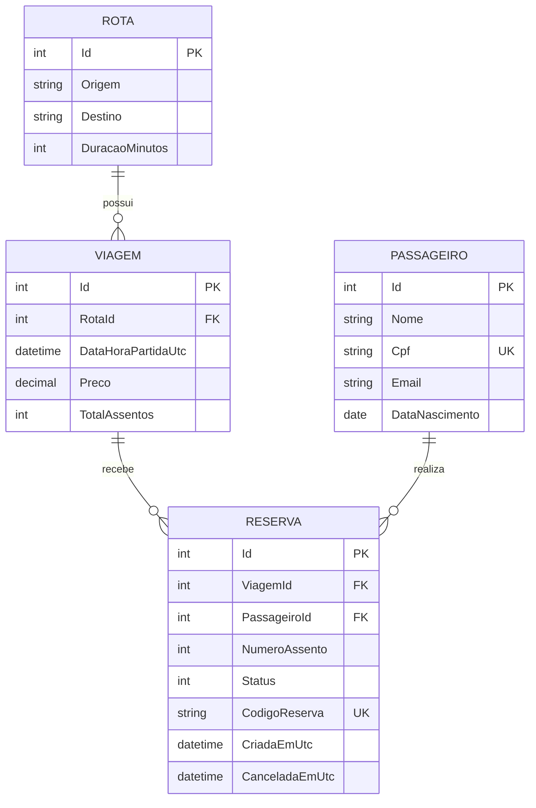

# Modelo Entidade/Relacionamento - OniBus Express

## Visao geral
Este modelo representa as entidades principais do dominio de vendas de passagens rodoviarias.

## Diagrama ER

## Relacionamentos
- Rota (1) -> (N) Viagem
- Viagem (1) -> (N) Reserva
- Passageiro (1) -> (N) Reserva

## Chaves e restricoes relevantes
- Chaves primarias: `Id` em todas as entidades.
- Chaves estrangeiras:
  - `Viagem.RotaId -> Rota.Id`
  - `Reserva.ViagemId -> Viagem.Id`
  - `Reserva.PassageiroId -> Passageiro.Id`
- Unicas:
  - `Passageiro.Cpf`
  - `Reserva.CodigoReserva`

## Regras de negocio ligadas ao modelo
- Uma reserva pertence a uma unica viagem e a um unico passageiro.
- Cancelamento de reserva depende do status e da antecedencia minima de 2 horas da partida.
- Uma viagem possui capacidade total (`TotalAssentos`) e as reservas consomem assentos.
