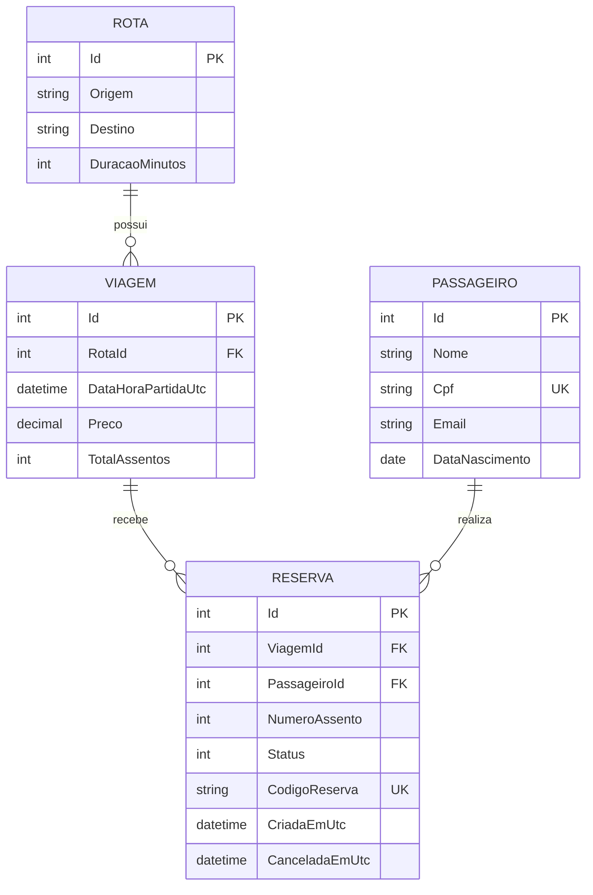
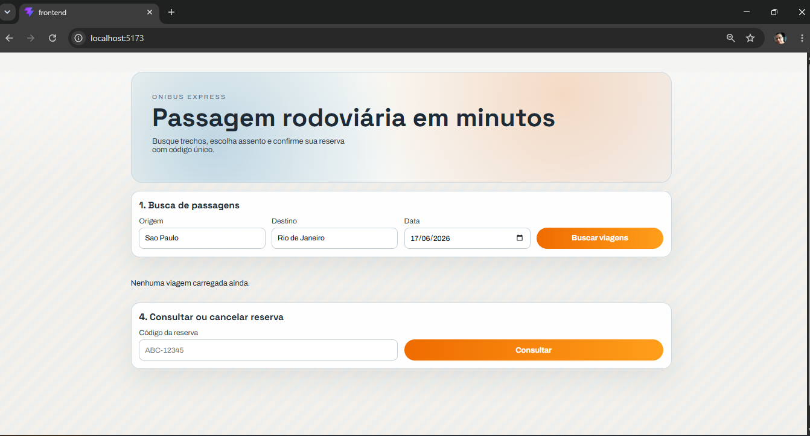
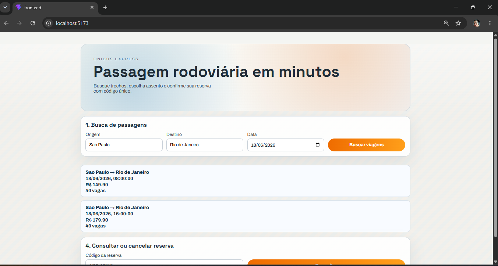
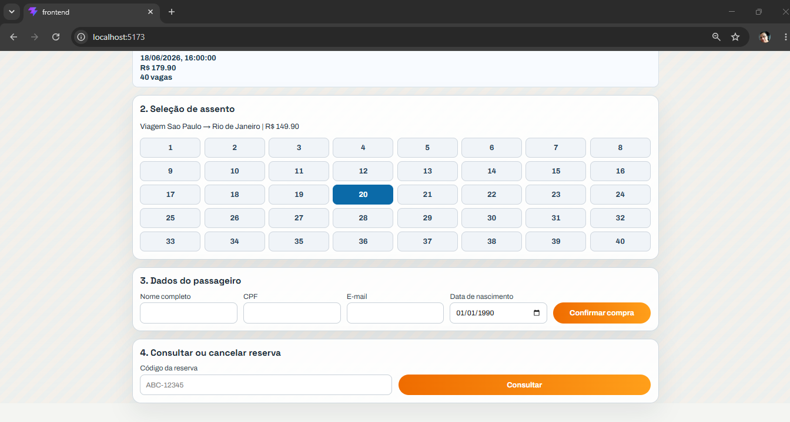
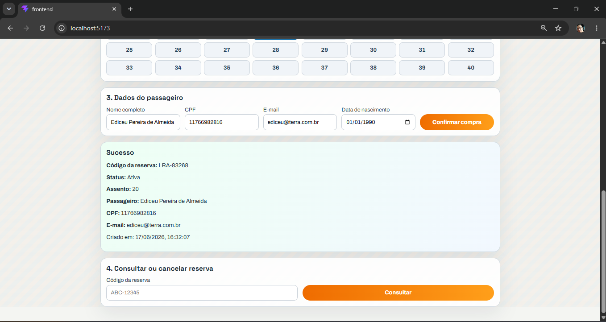
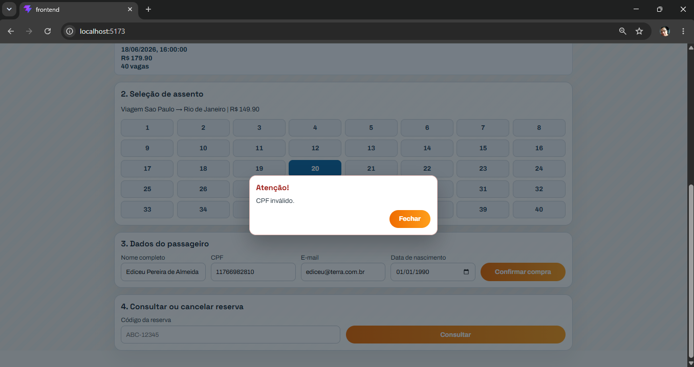
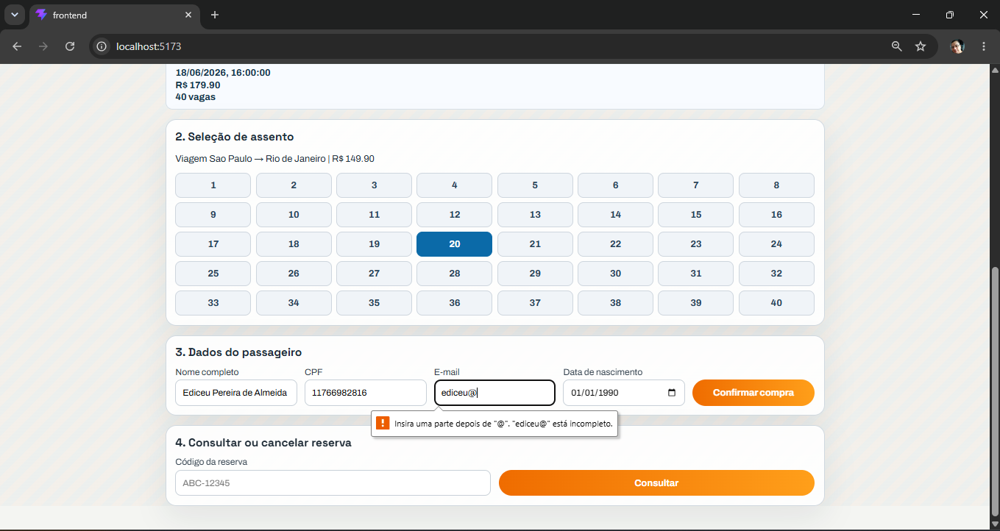
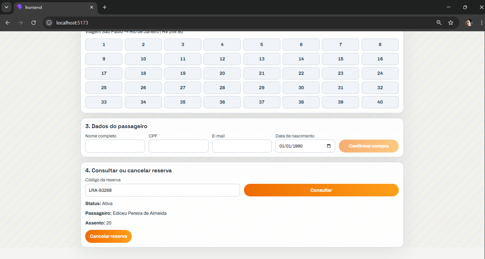
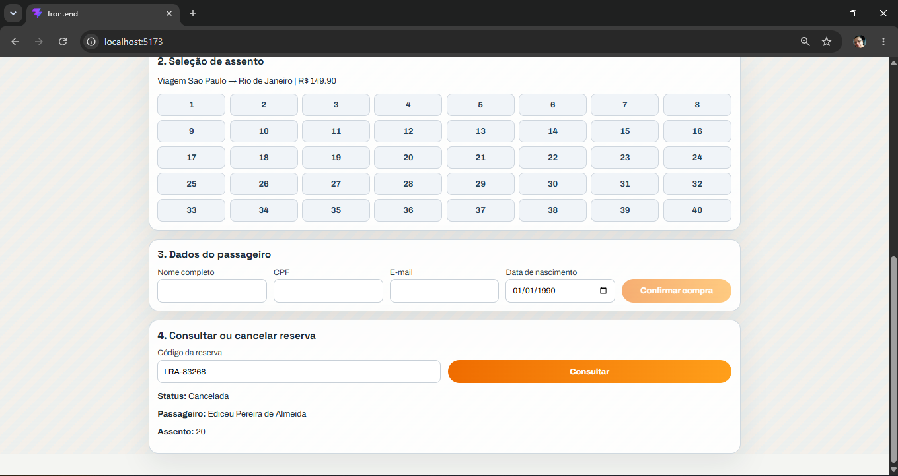

# OniBus Express

MVP para busca, compra e consulta de passagens rodoviárias com .NET 8 e React 19.

## O que este projeto entrega

Sistema web para:
- buscar viagens por origem, destino e data;
- visualizar assentos ocupados e disponíveis;
- reservar assentos com validações de negócio;
- consultar e cancelar reservas;
- operar localmente com e sem Docker.

---

## Tecnologias e bibliotecas usadas, e por quê

### Backend
- **ASP.NET Core 8**: base da API por ser o framework oficial do ecossistema .NET, com boa produtividade e performance.
- **Entity Framework Core 8**: persistência com migrations e modelagem forte, reduzindo boilerplate de acesso ao banco.
- **PostgreSQL 16**: banco relacional robusto, compatível com constraints e índices usados no domínio.
- **xUnit**: framework de testes simples e consolidado no ecossistema .NET.
- **SQLite in-memory**: usado nos testes de integração para evitar dependência externa de banco.
- **WebApplicationFactory**: permite testar a API HTTP sem subir servidor manualmente.

### Frontend
- **React 19**: composição por componentes e estado reativo para a UI do fluxo de compra.
- **TypeScript**: tipagem estática para reduzir erros e deixar contratos mais claros.
- **Zustand**: estado global enxuto; suficiente para o fluxo do app sem o peso de uma solução maior.
- **Vite**: build rápido e experiência de desenvolvimento com HMR.
- **@testing-library/react + user-event + Vitest**: testes mais próximos do comportamento real do usuário.
- **Nginx**: serve a SPA em produção/container com simplicidade e desempenho.

### Infraestrutura
- **Docker Compose**: orquestra API, frontend e PostgreSQL em desenvolvimento e execução local.
- **CORS**: libera a integração entre frontend e API quando estão em origens diferentes.
- **global.json**: fixa a versão do SDK .NET usada no projeto.

---

## Como rodar o projeto localmente

### Sem Docker

#### Pré-requisitos
- .NET SDK 8.x
- Node.js 22+
- PostgreSQL 16+ rodando localmente

#### Backend

```powershell
cd backend

$env:ConnectionStrings__Postgres="Host=localhost;Port=5432;Database=onibus_express;Username=postgres;Password=<SUA_SENHA>"
dotnet ef database update --project OnibusExpress.Infrastructure --startup-project OnibusExpress.Api
dotnet run --no-launch-profile --project OnibusExpress.Api
```

API local: http://localhost:8080

#### Frontend

```powershell
cd frontend
npm install
npm run dev
```

Frontend local: http://localhost:5173

Observação: o Vite está configurado para fazer proxy de `/rotas`, `/viagens` e `/reservas` para `http://localhost:8080`.

### Com Docker

#### Pré-requisitos
- Docker Desktop instalado e em execução
- Arquivo `.env` na raiz do projeto

#### Subir tudo

```powershell
docker compose up --build -d
```

Serviços expostos:
- Frontend: http://localhost:3000
- API: http://localhost:8080
- Swagger: http://localhost:8080/swagger
- PostgreSQL: localhost:5432

#### Parar tudo

```powershell
docker compose down
```

#### Logs

```powershell
docker compose logs -f
docker compose logs -f api
```

---

## Arquitetura e decisões relevantes

### Backend em camadas

```text
OnibusExpress.Api
    ↓
OnibusExpress.Application
    ↓
OnibusExpress.Infrastructure
    ↓
OnibusExpress.Domain
```

Fluxo principal:
- Controller → Service → Repository → Banco

### Decisões principais
1. **Separação em camadas**: facilita evolução, testes e manutenção.
2. **EF Core + migrations**: deixa o schema versionado e rastreável.
3. **Zustand no frontend**: reduz complexidade para um fluxo de compra relativamente simples.
4. **Proxy no Vite**: simplifica desenvolvimento local sem CORS manual.
5. **WebApplicationFactory nos testes de API**: garante cobertura HTTP sem levantar servidor separado.
6. **Docker Compose**: torna a execução local reproduzível.

---

## Modelo entidade/relacionamento



Detalhe completo: [MODELO_ENTIDADE_RELACIONAMENTO.md](MODELO_ENTIDADE_RELACIONAMENTO.md)

---

## O que foi implementado

### Backend
- API REST com 6 endpoints.
- 4 entidades principais: Rota, Viagem, Passageiro e Reserva.
- Serviços de aplicação para consulta e reserva.
- Persistência com EF Core e migrations.
- Regras de negócio: CPF, cancelamento com prazo, código único, assento único.

### Frontend
- Busca de viagens.
- Seleção de assento.
- Formulário de passageiro.
- Criação e consulta de reserva.
- Pop-up de erro com fechamento por botão, clique fora e `Esc`.

### Infraestrutura
- Docker Compose com backend, frontend e PostgreSQL.
- Healthcheck no banco.
- Configuração de CORS e proxy de desenvolvimento.

### Testes
- Testes unitários e de integração no backend.
- Testes de componentes e de comportamento do usuário no frontend.

---

## O que ficou de fora

- Autenticação e autorização.
- Rate limiting.
- Paginação.
- Cache distribuído.
- Logging centralizado/observabilidade.
- Testes E2E com navegador automatizado.
- Validação de e-mail mais estrita.
- Auditoria avançada.
- Multilíngue.

---

## Como rodar os testes

### Frontend

```powershell
cd frontend
npm run test
```

### Backend

```powershell
cd backend
$env:ConnectionStrings__Postgres="Host=localhost;Port=5432;Database=onibus_express;Username=postgres;Password=<SUA_SENHA>"
dotnet test OnibusExpress.sln -v minimal
```

Resultado atual esperado:
- Frontend: testes de componentes + comportamento do usuário.
- Backend: testes unitários e de integração.

---

## Endpoints e Swagger

- Swagger: http://localhost:8080/swagger

### GET /rotas
Lista rotas disponíveis.

### GET /viagens?origem=X&destino=Y&data=YYYY-MM-DD
Busca viagens e assentos disponíveis.

### GET /viagens/{id}
Detalhe da viagem com assentos ocupados.

### POST /reservas
Cria reserva.

### GET /reservas/{codigo}
Consulta reserva por código.

### DELETE /reservas/{codigo}
Cancela reserva, respeitando a regra das 2 horas.

---

## Extras e pontos de melhoria

### Extras úteis
- Screenshots/GIF da aplicação rodando podem ser adicionados aqui para demonstrar o fluxo principal.

#### Espaço reservado para mídia
- Tela inicial / busca de viagens



- Seleção de assento


- Formulário do passageiro


- Popup de erro



- Cancelamento de reserva




### Se eu tivesse mais tempo, eu implementaria
- Autenticação de usuários.
- Efetivação de Compra.
- Envio de Emails (Reserva, Efetivação de compra e Cancelamento).
- Histórico de reservas por passageiro.
- Mais testes E2E com Playwright.
- Observabilidade com logs estruturados e métricas.